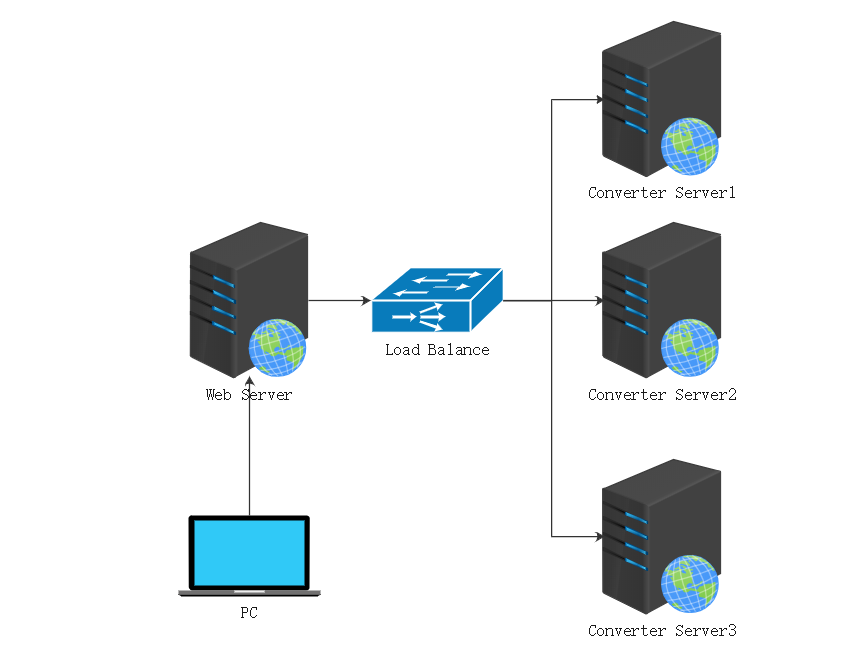

# 3DModelConvertToGltf 统一模型格式转换工具

此项目产生的主要原因是工作中遇到了需要**在Web中展示 STEP 和 IGES 模型的场景**，但是市面上的web3d类库均不支持此格式，并且用户上传的STL文件直接展示会占用大量带宽或者CDN流量，转换为压缩后的gltf会比较合适。

**支持输入格式：** STL/IGES/STEP/OBJ/FBX

**支持输出格式：** GLB

本项目即采用了博客中总结的思路：[STEP和IGES模型转换为适用Web的glb格式](https://blog.wj2015.com/2020/03/08/step%e5%92%8ciges%e6%a8%a1%e5%9e%8b%e8%bd%ac%e6%8d%a2%e4%b8%ba%e9%80%82%e7%94%a8web%e7%9a%84glb%e6%a0%bc%e5%bc%8f/)

**项目状态：** 研发中

## 文档

中文|[English](README.md)

## 待完成任务

- [x] 基本项目结构规划及接口设计
- [x] 转换及压缩代码实现
- [x] 增加 obj 的格式转换
- [ ] 相关接口实现
- [x] docker镜像打包
- [x] 一键转换脚本封装

## 为什么不用 assmip

我尝试用过 `assimp`，但是在 `stl/iges/obj` 转换场景测试下结果不大理想，我使用的 [https://hub.docker.com/r/dylankenneally/assimp](https://hub.docker.com/r/dylankenneally/assimp) 打包好的环境进行测试。

## 快速上手

由于环境配置麻烦等原因，命令行模式依旧需要依赖docker，**命令行模式适合服务端简单调用**，转换过程阻塞进程同步进行，无法分布式部署增加并发量等

> PS：命令行模式同步转换模型过多或者单个模型过大时，有把提供Web服务的服务器卡住的风险

## 配置说明

下列为默认配置 `server/config/app.yaml` ，请按需更改，如果使用docker需要映射配置文件

```yaml
app:
    background_process_num: 3 # 后台并发处理数量（仅api）
    save_upload_temp_file: 1 # 保存临时文件（原模型文件）
    save_convert_temp_file: 0 # 保存转换过程文件（模型格式转换文件）
redis: # Redis 配置，仅 API
    host: 127.0.0.1
    port: 6379
    password: 
    db: 1
upload: # 上传路径配置，仅 API
    path: uploads/
    maxsize: 30
```

### Docker运行

在宿主机安装好 `docker` 的条件下，运行如下指令获取镜像（大约4G）

```shell
docker pull wj2015/3d-model-convert-to-gltf
```

在 `/opt/3d-model-convert-to-gltf/server` 中执行 `conda run -n pythonocc python main.py` 可运行HTTP服务（未完成），容器内执行 `conda run -n pythonocc python convert.py [stl|step|iges|obj|fbx] input.stl out.glb` 可同步生成文件

### 命令行模式

下载代码中的 `convert.sh`，赋予执行权限，执行如下指令即可

脚本依赖于docker环境，所以 Docker 环境先准备好吧

```shell
convert.sh [stl|step|iges|obj|fbx] inputpath.stl outputpath.glb # 生成二进制文件
convert.sh [stl|step|iges|obj|fbx] inputpath.stl outputpath.gltf # 非仅生成二进制文件
```

在 `assets` 目录中，有五个测试文件 `test.stl` `test.stp` `test.igs` `E 45 Aircraft_obj.obj` `Samba Dancing.fbx`，将其复制到项目路径下，按照上述指令执行即可看到生成了对应结果。

> 如果在运行过程中遇到如下错误，可以执行如下指令，将其他语言执行器对应用户加到 docker 用户组中。
>
> > usermod -a -G docker nginx
> >
> 
> 
> docker: Got permission denied while trying to connect to the Docker daemon socket at unix:///var/run/docker.sock: Post http://%2Fvar%2Frun%2Fdocker.sock/v1.40/containers/create: dial unix /var/run/docker.sock: connect: permission denied.
>

通过其他语言调用可同步判断输出文件是否存在，来判断是否转换成功，如：

```php
<?php
$out = 'out.glb';
$input = 'test.stl';
$type = 'stl';
shell_exec('convert.sh '.$type.' '.$input.' '.$out);
if (file_exists($out)) {
    echo "convert result:" . $out;
} else {
    echo "convert failed";
}
```

### API模式（开发中）

首先，下载代码

```shell
git clone https://github.com/wangerzi/3d-model-convert-to-gltf.git
cd 3d-model-convert-to-gltf
```

建议使用 docker-compose 运行此项目，省去环境的烦恼

> config/ 是默认配置，通过docker目录映射的方式影响运行，如果修改了记得重启服务
>
> uploads/ 是上传文件和文件转换结果的目录，一般也是通过docker目录映射的方式运行

```shell
docker-compose up -d
```

默认映射到8080端口，然后就可以通过访问 http://IPAddress:8080/ 测试是否部署完成了

### 简单负载示意图

如果有多机负载的需求，可借助 nginx 的反向代理做一下简单的负载均衡



出于数据一致性考虑，分布式部署时可以有如下两种策略

- 使用一个 Redis 实例，**并把 upload 挂载到共享磁盘上**，优点是每个服务器的转换性能都能得到发挥，不会存在堆积任务等情况，缺点是麻烦
- 每个服务器使用本地Redis实例，优点是文件就在本地处理，部署比较简单，缺点是可能存在**某台机器任务堆积，其他机器空闲**的状况

### 接口文档

所有转换接口调用成功时的响应如下，`req_id` 可以通过接口获取当前队列进度

```json
{
    "code": 200,
    "message": "转换成功",
    "data": {
        "req_id": "长度41的sha1字符串"
    }
}
```

失败时，会有如下响应

```json
{
    "code": 999,
    "message": "错误信息",
    "data": {}
}
```

考虑到分布式部署的可能，所有的接口都**不会做文件转换缓存与去重**，所以**最好将此作为内网服务**，通过业务服务端请求本项目提供的接口

#### 转换STL接口

将Ascii格式的，或者二进制格式的STL文件，统一转换为GLTF

**方法：** POST

**路径：** /convert/stl

**请求参数**

| 参数名称       | 类型   | 必填 | 描述                                                         |
| -------------- | ------ | ---- | ------------------------------------------------------------ |
| file           | File   | 是   | 上传STL文件                                                  |
| callback       | string | 是   | 异步钩子地址，转换完毕后，会将文件链接和附带信息传递到Hook中 |
| customize_data | JSON   | 否   | 附带的信息，回调时会传输                                     |

#### 转换STP接口

将STEP格式的模型文件，统一转换为GLTF

**方法：** POST

**路径：** /convert/stp

**请求参数**

| 参数名称       | 类型   | 必填 | 描述                                                         |
| -------------- | ------ | ---- | ------------------------------------------------------------ |
| file           | File   | 是   | 上传STEP文件                                                 |
| callback       | string | 是   | 异步钩子地址，转换完毕后，会将文件链接和附带信息传递到Hook中 |
| customize_data | JSON   | 否   | 附带的信息，回调时会传输                                     |

#### 转换IGES接口

将IGES格式的模型文件，统一转换为GLTF

**方法：** POST

**路径：** /convert/iges

**请求参数**

| 参数名称       | 类型   | 必填 | 描述                                                         |
| -------------- | ------ | ---- | ------------------------------------------------------------ |
| file           | File   | 是   | 上传IGES文件                                                 |
| callback       | string | 是   | 异步钩子地址，转换完毕后，会将文件链接和附带信息传递到Hook中 |
| customize_data | text   | 否   | 附带的信息，回调时会传输（建议传JSON）                       |

#### 获取转换进度

根据 req_id 获取当前转换进度

**方法：** GET

**路径：** /convert/process

**请求参数**

| 参数名称 | 类型   | 必填   | 描述           |
| -------- | ------ | ------ | -------------- |
| req_id   | string | 转换id | 转换时返回的id |

**响应样例**

```json
{
    "code": 200,
    "data": {
        "current": 1,
        "total": 100,
        "status": 0
    }
}
```

> status 为0表示等待中，status 为1表示转换中，status 为2表示已完成

### 转换回调规范

接口文档中提到的 callback 参数，用于转换完毕后主动调用，用于传输转换结果文件以及附带信息。

为方便起见，可以在 callback 中的GET参数上拼接好模型 id，比如下面的 url 表示转换 id=1 的模型，这个 id 会随着回调的调用而被传递过去

> http://xxx.com/convert/callback?id=1

**提供参数**

| 参数           | 类型    | 描述                        |
| -------------- | ------- | --------------------------- |
| result         | integer | 转换结果1转换失败 0转换失败 |
| message        | string  | 错误描述                    |
| file           | File    | 文件内容（POST表单的形式）  |
| customize_data | text    | 请求时附带的信息            |

**响应规范**

如果正常接受或者无视，请返回如下格式的JSON，并保证 code: 200

```json
{
    "code": 200
}
```

如果**处理失败**，请则返回**空或 JSON 中的 code 不为 200**，返回失败的数据则会以 **5/15/30/60/120 的间隔**重新推送，均失败后将丢弃不再推送

## Redis设计

待处理队列统一放到 `3d-preview-model-waiting`，列表存放的是全局唯一的 `req_id`

处理中/未处理的信息都放在 `3d-preview-model-data-${req_id}` 中，value是文件属性组成的JSON，自动失效时间默认为2天，格式如下

```json
{
    "type": "stl",
    "file": "/usr/share/nginx/html/uploads/xxx.stl",
    "status": 1,
    "result": {
        "glb": "/usr/share/nginx/html/uploads/xxx.glb"
    }
}
```

处理成功的 `req_id` 放到 `3d-preview-model-convert-success` Hash表中，存放的key是全局唯一的 `req_id`，**通知成功或者重复通知多次超时后会从其中移除**，移除时会顺带删除生成的文件以及  `3d-preview-model-data-${req_id}`

## 参与开发

首先需要了解下 [aio-http](https://aiohttp.readthedocs.io/en/stable/) ，本项目就是基于此Web框架实现的

创建一下 conda 虚拟环境
```shell script
conda create -n 3d-model-convert-to-gltf-pythonocc -c dlr-sc -c pythonocc pythonocc-core=7.4.0rc1
conda activate 3d-model-convert-to-gltf-pythonocc
pip install -r server/requirements.txt
```

本地运行代码强烈建议进入到 `server/` 后使用 `aiohttp-devtools runserver`方便调试，本地的 node 版本需要是 `12.0.0`，否则 `gltf-pipeline` 无法运行，需要安装 `gltf-pipeline` 和 `obj2gltf` 两个 npm 包。

### 本地调试环境安装指引
可以使用如下指令安装 `nvm`（MacOs or Linux），Windows需下载可执行文件 [https://github.com/coreybutler/nvm-windows](https://github.com/coreybutler/nvm-windows)
```shell script
curl -o- https://raw.githubusercontent.com/nvm-sh/nvm/v0.35.3/install.sh | bash
```
安装 12.0.0，以及安装依赖包
```shell script
nvm install 12.0.0
nvm use 12.0.0
npm install -g gltf-pipeline obj2gltf
```
再去 FBX2glTF 下载对应系统的可执行文件，放到环境变量文件夹中，地址： [https://github.com/facebookincubator/FBX2glTF](https://github.com/facebookincubator/FBX2glTF)

> PS:  为保证调用命名统一，需要将指令重命名为 fbx2gltf，否则转换 FBX 出错

简单了解下代码结构，修改完毕后提交PR即可，欢迎邮箱 admin@wj2015.com 与我讨论

## 开源协议

3DModelConvertToGltf is licensed under the Apache License, Version 2.0. See [LICENSE](https://github.com/GitbookIO/gitbook/blob/master/LICENSE) for the full license text.